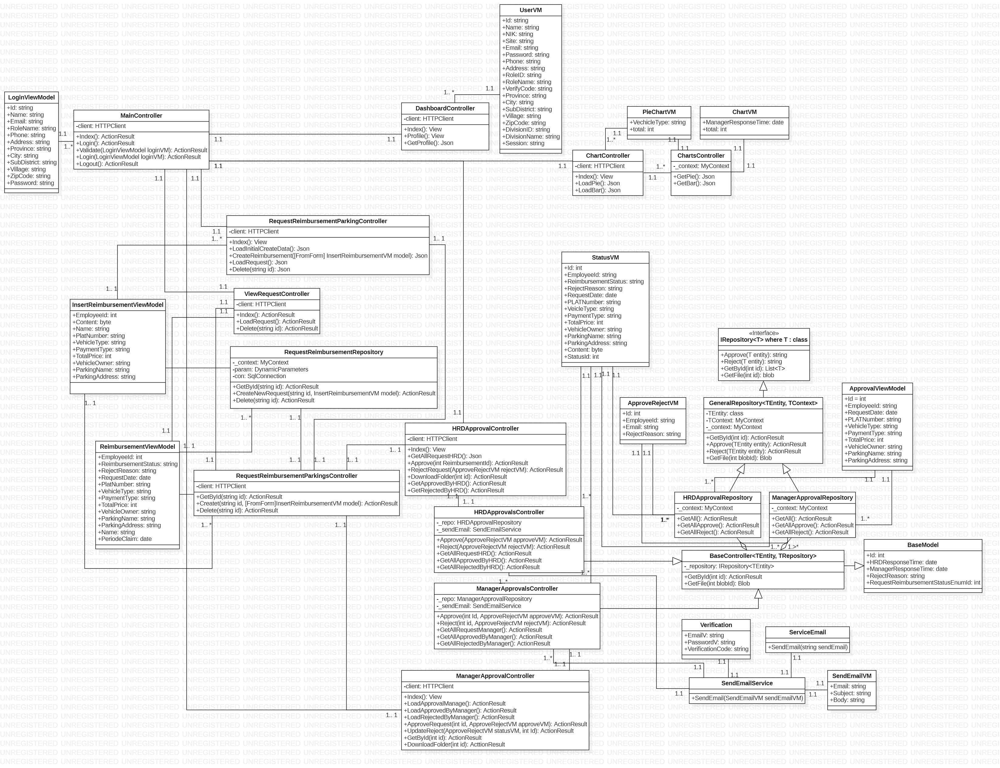

# Kelompok2_Reimbursement-Parking_Cahya_Oscar_Nawa
## [Table of Contents](#)

- [Progress](#progress)
- [SDLC](#sdlc)
    - [ERD](#ERD)
    - [Use Case Diagram](#use-case-diagram)
    - [BPMN](#bpmn)
    - [Activity_Diagram](#activity-diagram)
    - [Class_Diagram](#class-diagram)

## Progress

- `Tuesday (22/09/2020)`:
- [x] ERD
- [x] Use Case
- [x] BPMN
- [x] Activity Diagram
- [x] Class Diagram
- [x] LayOut AdminLTE

-`Wednesday (23/09/2020)`:
- [x] Added Database

## SDLC

- `ERD`

- `Use Case Diagram`

- `BPMN`

- `Activity Diagram`

- `Class Diagram`

